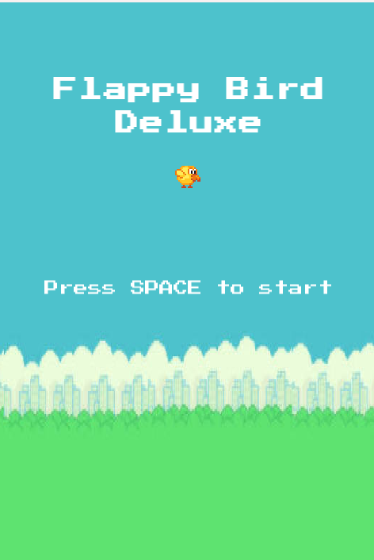
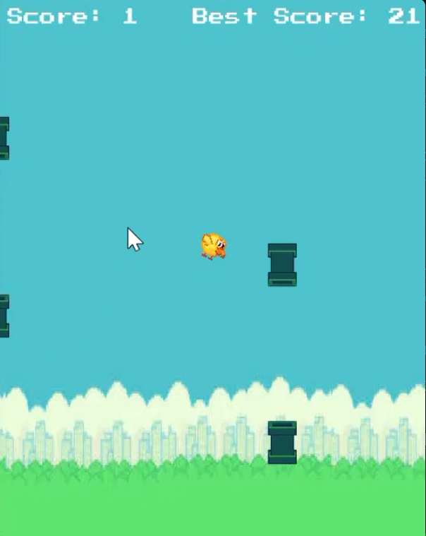
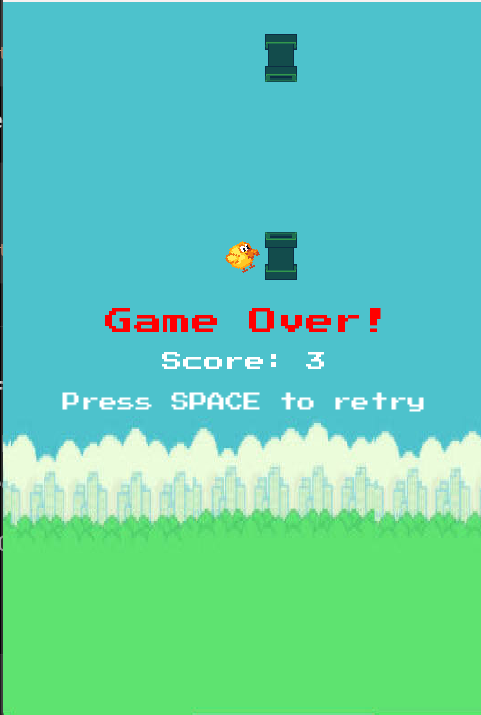

#Flappy Bird Uzwa Edition

A fully object-oriented recreation of Flappy Bird, built from scratch in **C++** using **SFML 3.1.0**. This project focuses on clean OOP architecture, real-time physics, collision detection, and persistent score tracking — no game engine, no shortcuts, just C++ and a graphics library.



## Overview

Flappy Bird Uzwa Edition reimplements the classic one-button arcade game with a custom art style, dynamic difficulty scaling, sound effects, and a persistent high score system. The project was built to practice core Object-Oriented Programming principles — composition, encapsulation, and state management — in a real, playable application rather than an abstract exercise.

## Features

- **Classic one-button gameplay** — press `SPACE` to flap, avoid the pipes, survive as long as possible
- **Dynamic difficulty scaling** — pipe speed increases as your score climbs
- **Persistent high scores** — your best score is saved to disk and reloaded on every launch
- **Full game state machine** — Menu, Playing, and Game Over states, each with their own UI
- **Sound effects** — dedicated audio cues for flapping, scoring, and collisions
- **Custom UI** — dynamically centered and aligned text that adapts to string length, so nothing overlaps or clips regardless of score size
- **Scrolling parallax-style world** — background and pipes move independently for visual depth

## Screenshots

| Main Menu | Gameplay | Game Over |
|:---:|:---:|:---:|
|  |  |  |

## Tech Stack

- **Language:** C++17
- **Graphics/Audio Library:** [SFML 3.1.0](https://www.sfml-dev.org/)
- **Package Manager:** vcpkg
- **IDE:** Visual Studio 2026
- **Build System:** MSBuild (Visual Studio project) — CMake-compatible structure

## Architecture

The project follows an object-oriented design where each core system is isolated into its own class, following the **composition** principle — the `Game` class owns and coordinates instances of every other system rather than everything living in one monolithic file.

```
Game (state machine & main loop)
 ├── Background   → parallax scrolling backdrop
 ├── Bird         → physics, rotation, rendering
 ├── PipeManager  → spawns and recycles Pipe objects
 │    └── Pipe    → individual obstacle pair (top + bottom)
 └── ScoreManager → score tracking & persistent high score I/O
```

**Notable design decisions:**
- Pipes are managed using a **fixed-size array with an object pool pattern** (`active` flag per slot) rather than `std::vector`, as a deliberate exercise in manual memory/lifetime management instead of relying on dynamic containers.
- All UI text is **dynamically re-centered and re-aligned** on every update, so score/best-score/menu text never overflows or clips regardless of digit count or string length.
- Game state (`MENU`, `PLAYING`, `GAME_OVER`) is managed through a simple `enum class`, keeping input handling, updates, and rendering logic cleanly separated per state.

## Project Structure

```
FlappingBirdUzwaEdition/
├── Assets/
│   ├── Textures/     bird.png, pipe.png, background.png
│   ├── Fonts/        font.ttf
│   └── Sounds/       flap.mp3, hit.mp3, score.mp3
├── src/
│   ├── main.cpp
│   ├── Game.h / Game.cpp
│   ├── Bird.h / Bird.cpp
│   ├── Pipe.h / Pipe.cpp
│   ├── PipeManager.h / PipeManager.cpp
│   ├── Background.h / Background.cpp
│   └── ScoreManager.h / ScoreManager.cpp
├── highscore.txt
└── README.md
```

## Getting Started

### Prerequisites
- Visual Studio 2022/2026 with Desktop C++ development workload
- [vcpkg](https://github.com/microsoft/vcpkg) with SFML 3.1.0 installed:
  ```
  vcpkg install sfml
  ```

### Build & Run
1. Clone the repository:
   ```
   git clone https://github.com/<your-username>/FlappingBirdDeluxe.git
   ```
2. Open the solution in Visual Studio.
3. Ensure the project is set to **x64 / Debug** (or Release) and linked against SFML via vcpkg's manifest mode.
4. Build and run (`F5` or `Ctrl+F5`).

> Make sure the `Assets/` folder sits alongside the executable's working directory — check **Project Properties → Debugging → Working Directory** if assets fail to load.

## Controls

| Key | Action |
|---|---|
| `SPACE` | Flap / Start game / Retry after Game Over |

## What I Learned

This project was built as a hands-on exercise in applying first-year C++ and OOP coursework to a real, interactive application. Key takeaways:
- Structuring a multi-class C++ project with clean header/implementation separation
- Managing object lifetimes manually using a fixed-array object pool instead of dynamic containers
- Working with a real graphics/audio library (SFML) — including migrating code across a major API version change (SFML 2 → 3)
- Handling real-time physics (gravity, velocity, rotation) with frame-independent movement via delta time
- Debugging asset pipeline issues (file paths, working directories, texture atlases/spritesheet cropping)
- Building readable, responsive UI text that adapts to dynamic content

## Roadmap

Planned improvements for future iterations:
- [ ] Bird flap animation using multi-frame spritesheet cycling
- [ ] Scrolling ground layer
- [ ] Pause menu
- [ ] Particle effects on collision
- [ ] Selectable bird skins / color themes

## License

This project is open source and available for learning purposes. Feel free to fork and build on it.

## Acknowledgements

- Art assets adapted from a free Flappy Bird asset pack (itch.io)
- Built with [SFML](https://www.sfml-dev.org/) — Simple and Fast Multimedia Library

## Author

**Uzwa Shahid**
BS Computer Science, FAST University
